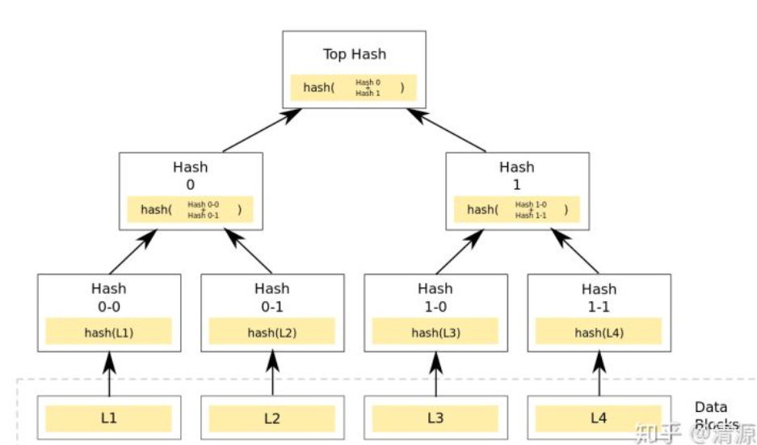
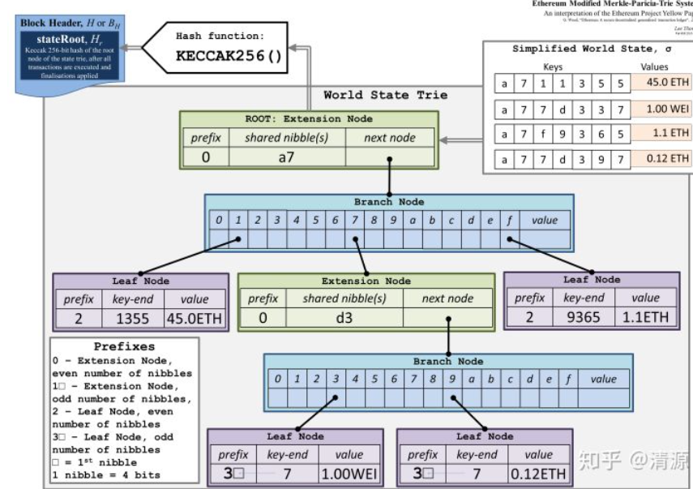
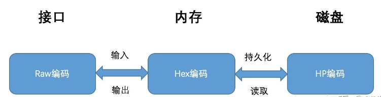

## 项目说明 -- MPT研究报告

✅Project: research  report on MPT

## 默克尔树（Merkle tree）

​		默克尔树首先计算叶子节点的hash值，然后将相邻两个节点的哈希进行合并，合并完成后计算这个字符串的哈希值，直到根节点为止，如果是单个节点，可以复制单节点的哈希，然后合并哈希再重复上面的过程。

**优点**

可以高效安全的验证数据结构的内容。

**典型场景**

p2p网络分块下载文件的时候，快速校验下载到的数据是否完整，是否遭到破坏。

## Merkle Patricia Tree

​		MPT树结合了字典树和默克尔树的优点，在压缩字典树中根节点是空的，而MPT树可以在根节点保存整棵树的哈希校验和，而校验和的生成则是采用了和默克尔树生成一致的方式。 以太坊采用MPT树来保存，交易，交易的收据以及世界状态，为了**压缩整体的树高，降低操作的复杂度**，以太坊又对MPT树进行了一些优化。将树节点分成了四种；

- 空节点（hashNode）
- 叶子节点（valueNode）
- 分支节点（fullNode）
- 扩展节点（shortNode

可以看到有四个状态要存储在世界状态的MPT树中，需要存入的值是键值对的形式。

- 首先看到的根哈希，由**keccak256**生成的，参考默克尔树的Top Hash，
- 绿色的扩展节点Extension Node，其中共同前缀shared nibble是a7，采用了压缩前缀树的方式进行了合并，
- 蓝色的分支节点Branch Node，其中有表示十六进制的字符和一个value，最后的value是fullnode的数据部分，
- 紫色的叶子节点leadfNode，用来存储具体的数据，它也是对路径进行了压缩。

### MPT树持久化

​		以太坊的MPT树提供了三种不同的编码方式来满足不同场景的不同需求，三种编码方式为；

- Raw编码（原生字符）
- Hex编码（扩展16进制编码）
- Hex-Prefix编码（16进制前缀编码）

​		三者的关系如下图所示，分别解决的是MPT对外提供接口的编码，在内存中的编码，和持久化到数据库中的编码。

### 安全的MPT

​		在上面介绍三种编码并没有解决一个问题，如果我们的key非常的长，会导致树非常的深，读写性能急剧的下降，如果有人不怀好意设计了一个独特的key甚至是可以起到DDOS攻击的作用，为了避免上面的问题，以太坊将所有的key都进行了一个`keccak256(key)`的操作。

### 持久存储

​		MPT树最终持久化到LevelDB中是k-v的形式，还需要对value进行处理。在以太坊存储键值对之前会采用RLP([以太坊RLP编码](https://link.zhihu.com/?target=http%3A//qyuan.top/2019/05/20/rlp/))对键值对进行转码，将键值对编码后作为value，计算编码后数据的哈希（keccak256）作为key，存储在levelDB中。

​		在具体的实现中，为了避免出现相同的key，以太坊会给key增加一些前缀用作区分，比如合约中的MPT树，会增加合约地址，区块数据会增加表示区块的字符和区块号。

​		MPT树是以太坊非常非常核心的数据结构，在存储区块，交易，交易回执中都有用到。其实随着数据的膨胀，LevelDB的读写速度都会变慢，这个是LevelDB实现导致的，目前也有一些针对性的优化。还有一种和MPT树非常相近的另一种数据结构[BucketTree](https://link.zhihu.com/?target=http%3A//qyuan.top/2019/04/18/BucketTree/)，也可以实现相同的功能，各有优劣。